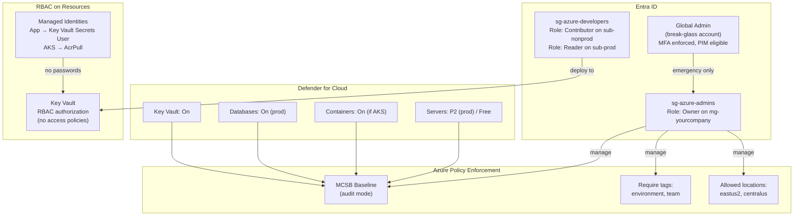

# Architecture Diagrams

## Landing Zone Overview

## Graduation Path

## Networking Architecture

> **Note:** All subnets have a default deny-all-inbound NSG rule. The `/18` AKS subnet is intentionally large because Azure CNI allocates one IP per pod.

## Security Model

