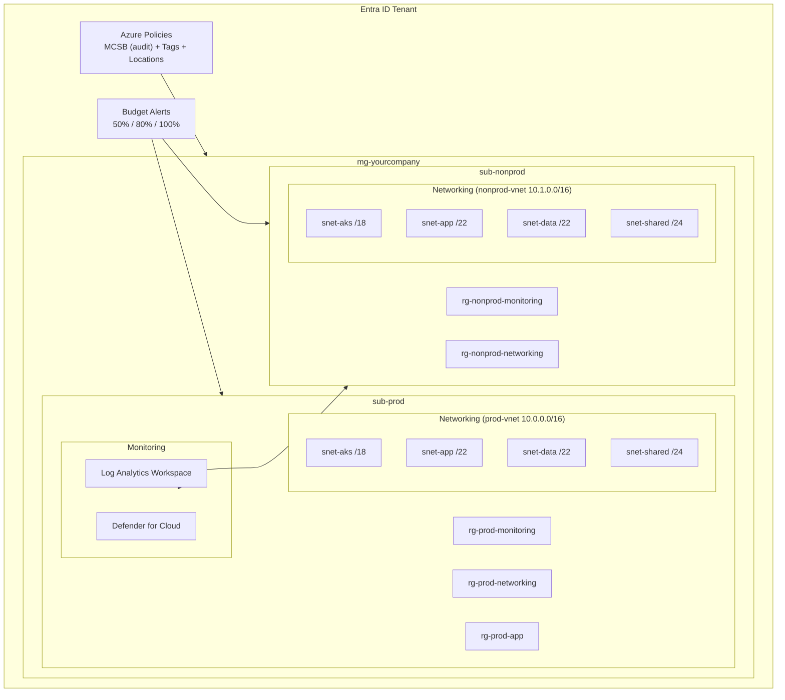
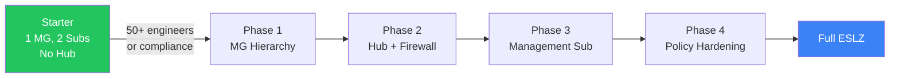

# Architecture Diagrams

## Landing Zone Overview (Mermaid)



## Graduation Path (Mermaid)



## Generating Diagrams

These Mermaid diagrams render natively on GitHub. For higher-quality visuals:

1. **VS Code:** Install the "Mermaid" extension for live preview
2. **CLI:** Use `mmdc` (mermaid-cli) to export as PNG/SVG:
   ```bash
   npx @mermaid-js/mermaid-cli mmdc -i architecture.md -o architecture.png
   ```
3. **draw.io:** Import the `.drawio` files in this directory (if added by contributors)
